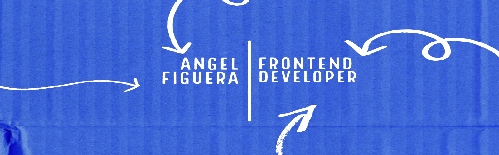

# Hello there! :wave:

My name is Angel, i am 24 years old and a passionate, innovative and proactive developer. Daily improving, constant learning and application of the best practices through Frontend web development and programming. Proficient with the most modern technologies like Javascript ES6+, Typescript, React JS and Vue js.
 

I like to write code, for me it is like a hobby because I have a lot of fun although sometimes it gets a bit rough.
 

I think that curiosity is the key to knowledge :bulb:.

## Technical Skills & Tools 🔧

- [CSS3](https://developer.mozilla.org/en-US/docs/Web/css)
- [HTML5](https://developer.mozilla.org/en-US/docs/Web/html)
- [Javascript](https://developer.mozilla.org/en-US/docs/Web/javascript)
- [SASS/SCSS](https://sass-lang.com/)
- [Typescript](https://www.typescriptlang.org/)
- [React JS](https://reactjs.org/)
- [Vue](https://vuejs.org/)
- [Git](https://git-scm.com/)
- [Node](https://nodejs.org/en/)
- [Powershell](https://learn.microsoft.com/en-us/powershell/)
- [Visual Studio Code](https://code.visualstudio.com/)
- [Windows OS](https://www.microsoft.com/en-us/windows)

## Stats for nerds (maybe not accurate)

| | | |
| :--: | :--: | :--: |
| `Most used langs` 

| `Github stats` 

| `Github streak` 

## Top 5 projects

